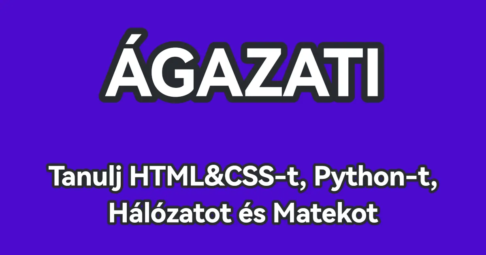

# 🎓 Agazati - Oktatási Weboldal

<div align="center">

[](https://github.com/XxHaltiruXx/agazati/blob/main/LICENSE)
[](https://github.com/XxHaltiruXx/agazati/stargazers)
[](https://github.com/XxHaltiruXx/agazati/network/members)
[](https://github.com/XxHaltiruXx/agazati/issues)

**Interaktív oktatási platform HTML, CSS, Python, Hálózatok és Matematika tanulásához**

[🌐 Élő Demo](https://xxhaltiruxx.github.io/agazati/) • [📝 Hibajelentés](https://github.com/XxHaltiruXx/agazati/issues) • [💡 Új funkció kérés](https://github.com/XxHaltiruXx/agazati/issues)

</div>

---

## 📸 Előnézet

<div align="center">
  
</div>

---

## ✨ Főbb funkciók

| Funkció | Leírás |
|---------|--------|
| 📚 **Több témakör** | HTML, CSS, Python, Hálózatok, Matematika |
| 🐍 **Python Runner** | Böngészőben futtatható Python kód (Pyodide) |
| 🌐 **HTML/CSS Runner** | Élő HTML & CSS szerkesztő |
| 🔍 **Keresés** | Intelligens keresési javaslatok |
| 📱 **Reszponzív** | Minden eszközön tökéletesen működik |
| 🎨 **Modern UI** | Glassmorphism & gradient design |
| 🔐 **Bejelentkezés** | Védett tartalmak elérése |

---

## 🗂️ Projekt struktúra

```
agazati/
├── 📁 assets/
│   ├── 📁 css/           # Stíluslapok
│   │   ├── base.css      # Alap stílusok
│   │   ├── main.css      # Fő stílusok
│   │   ├── nav.css       # Navigáció
│   │   ├── footer.css    # Lábléc
│   │   └── utilities.css # Segéd osztályok
│   ├── 📁 js/            # JavaScript fájlok
│   │   ├── nav.js        # Navigáció & sidebar
│   │   ├── search.js     # Keresés funkció
│   │   ├── footer.js     # GitHub commit info
│   │   └── quiz.js       # Kvíz rendszer
│   ├── 📁 fonts/         # Betűtípusok
│   └── 📁 images/        # Képek & ikonok
├── 📁 html/
│   ├── 📁 alapok/        # HTML alapok
│   ├── 📁 run/           # HTML/CSS Runner
│   └── index.html
├── 📁 css/
│   ├── 📁 alapok/        # CSS alapok
│   └── index.html
├── 📁 python/
│   ├── 📁 alapok/        # Python alapok
│   ├── 📁 run/           # Python Runner (Pyodide)
│   └── index.html
├── 📁 network/
│   ├── 📁 alapok/        # Hálózat alapok
│   └── index.html
├── 📁 math/
│   └── index.html
├── 📄 index.html         # Főoldal
├── 📄 404.html           # 404 oldal
├── 📄 sitemap.xml        # Sitemap
└── 📄 README.md
```

---

## 🛠️ Technológiák

<div align="center">


</div>

### Részletek

- **Bootstrap 5.3.3** - Reszponzív UI komponensek
- **Pyodide** - Python a böngészőben (WebAssembly)
- **Space Grotesk** - Modern betűtípus
- **GitHub API** - Utolsó commit dátum megjelenítése
- **SessionStorage** - Navigáció állapot mentése

---

## 🚀 Telepítés

### Előfeltételek

- Egy modern böngésző (Chrome, Firefox, Edge, Safari)
- Opcionális: Lokális webszerver (pl. Live Server VS Code-ban)

### Lépések

1. **Klónozd a repository-t**
   ```bash
   git clone https://github.com/XxHaltiruXx/agazati.git
   cd agazati
   ```

2. **Nyisd meg a böngészőben**
   - Egyszerűen nyisd meg az `index.html` fájlt
   - Vagy használj Live Server-t a VS Code-ban

3. **Kész!** 🎉

---

## 📖 Használat

### 🏠 Főoldal
- **Keresés** - Írj be egy témát (pl. "Python") és nyomj Entert
- **Kategóriák** - Kattints a kártyákra a részletekért
- **Sidebar** - ☰ gombbal nyitható a navigációs menü

### 🐍 Python Runner
- Írj Python kódot a szerkesztőbe
- Kattints a "Futtatás" gombra
- Az eredmény alul jelenik meg

### 🌐 HTML/CSS Runner
- Bal oldalt HTML, jobb oldalt CSS szerkesztő
- Valós idejű előnézet alul

---

## 🎨 Képernyőképek

| Főoldal | Python Runner |
|---------|---------------|
| Modern kártya-alapú design | Böngészőben futó Python |

| Sidebar | Keresés |
|---------|---------|
| Kategorizált navigáció | Intelligens javaslatok |

---

## 🤝 Közreműködés

Szívesen fogadunk minden hozzájárulást! 

1. **Fork** - Készíts egy fork-ot a repository-ból
2. **Branch** - Hozz létre egy új branch-et (`git checkout -b feature/uj-funkcio`)
3. **Commit** - Commitold a változtatásokat (`git commit -m 'Új funkció hozzáadva'`)
4. **Push** - Pushold a branch-et (`git push origin feature/uj-funkcio`)
5. **Pull Request** - Nyiss egy Pull Request-et

### Fejlesztési irányelvek

- Kövesd a meglévő kódstílust
- Tesztelj több böngészőben
- Dokumentáld az új funkciókat

---

## 📝 TODO

- [ ] JavaScript szekció hozzáadása
- [ ] C# szekció hozzáadása
- [ ] Sötét/világos téma váltás
- [ ] Több nyelv támogatása
- [ ] Offline támogatás (PWA)

---

## 📜 Licenc

Ez a projekt az **MIT licenc** alatt érhető el. Részletekért lásd a [LICENSE](LICENSE) fájlt.

---

## 📬 Kapcsolat

<div align="center">

[](mailto:agazati.info@gmail.com)
[](https://github.com/XxHaltiruXx)

</div>

---

<div align="center">

**⭐ Ha tetszett a projekt, adj egy csillagot! ⭐**

Made with ❤️ by [XxHaltiruXx](https://github.com/XxHaltiruXx) and [Twenji](https://github.com/TweNJ1)

</div>

