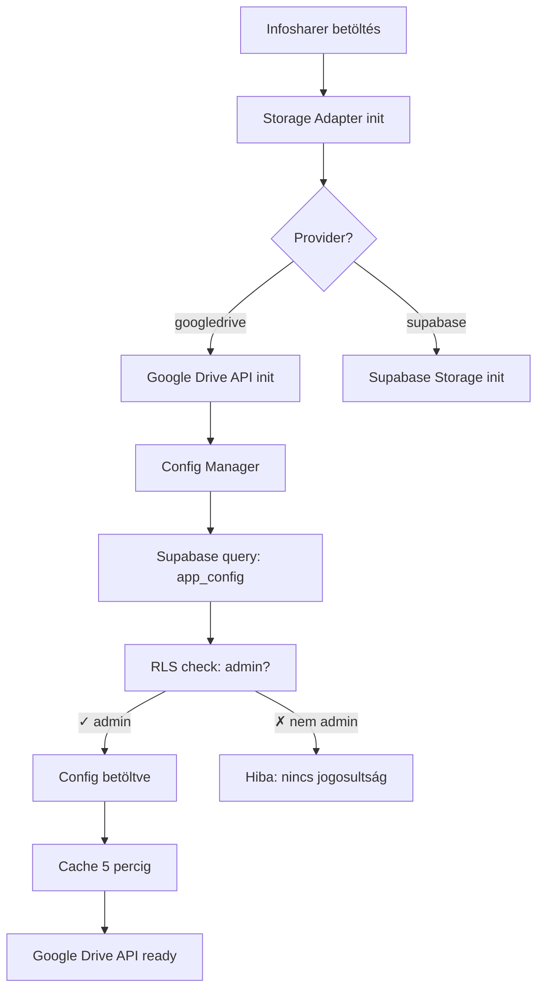

# ✅ Google Drive Integráció - Supabase Config Tárolással

## 🎉 Sikeres implementáció!

Az Infosharer Google Drive integrációja készen van, és a **kulcsok biztonságosan Supabase-ben** vannak tárolva!

## 🔧 Amit megvalósítottunk:

### 1. ✅ Hibajavítások
- JSDoc szintaxis hibák javítva a `google-drive-api.js`-ben
- Fájl struktúra megtisztítva
- Export szintaxis javítva

### 2. ✅ Supabase Config Storage
**Új fájlok:**
- `assets/js/google-drive-config-manager.js` - Config betöltés/mentés
- `database/google-drive-config-table.sql` - SQL tábla létrehozás
- `docs/GOOGLE-DRIVE-SUPABASE-CONFIG.md` - Setup útmutató

**Funkcionalitás:**
- Kulcsok Supabase `app_config` táblában
- RLS policy: csak adminok férnek hozzá
- 5 perc cache a gyors betöltéshez
- Automatikus validáció

### 3. ✅ Biztonság
- ❌ **RÉGI**: Kulcsok a frontend kódban
- ✅ **ÚJ**: Kulcsok Supabase-ben, RLS védve
- ✅ Csak admin felhasználók láthatják
- ✅ Nincs érzékeny adat a git repo-ban
- ✅ SQL UPDATE-tel könnyű frissítés

## 📋 Gyors használat

### 1. Supabase tábla létrehozása:
```sql
-- Futtasd le: database/google-drive-config-table.sql
```

### 2. Google Cloud beállítása:
- API Key létrehozása
- Google Drive mappa létrehozása
- Mappa publikusan megosztva (Reader jog)

### 3. Konfiguráció Supabase-be:
```sql
UPDATE app_config
SET value = jsonb_build_object(
    'API_KEY', 'YOUR_API_KEY',
    'FOLDER_ID', 'YOUR_FOLDER_ID',
    'DISCOVERY_DOCS', jsonb_build_array('https://www.googleapis.com/discovery/v1/apis/drive/v3/rest')
)
WHERE key = 'google_drive_config';
```

### 4. Storage provider váltás:
```javascript
// storage-adapter.js
const STORAGE_PROVIDER = 'googledrive';
```

## 🔐 Biztonság

### RLS Policy védelem:
```sql
-- Csak adminok olvashatják
CREATE POLICY "Adminok olvashatják a konfigurációt"
ON app_config FOR SELECT TO authenticated
USING (
  EXISTS (
    SELECT 1 FROM user_roles
    WHERE user_roles.user_id = auth.uid()
    AND user_roles.role = 'admin'
  )
);
```

### Cache mechanizmus:
```javascript
// 5 perc cache, hogy ne terheljük a Supabase-t
const CACHE_DURATION = 5 * 60 * 1000;
```

## 📊 Előnyök

| Funkció | Előny |
|---------|-------|
| **Biztonság** | RLS policy védelem, csak adminok |
| **Karbantartás** | SQL UPDATE, nincs kód módosítás |
| **Git clean** | Nincs érzékeny adat a repo-ban |
| **Teljesítmény** | 5 perc cache, gyors betöltés |
| **Auditálhatóság** | `updated_at` mező minden változásnál |
| **Validáció** | Automatikus config validáció |

## 🔄 Workflow



## 📁 Fájlstruktúra

```
assets/js/
├── google-drive-api.js              ✅ Google Drive API wrapper (javítva)
├── google-drive-config-manager.js   ✨ ÚJ: Config kezelés
└── storage-adapter.js               ✅ Frissítve Supabase config-gel

database/
└── google-drive-config-table.sql    ✨ ÚJ: SQL setup script

docs/
├── GOOGLE-DRIVE-SUPABASE-CONFIG.md  ✨ ÚJ: Setup útmutató
├── GOOGLE-DRIVE-SETUP.md            📖 Eredeti setup
├── GOOGLE-DRIVE-INTEGRATION.md      📖 Integráció áttekintés
└── GOOGLE-DRIVE-QUICKSTART.md       📖 Gyors kezdés
```

## 🐛 Hibák javítva

### 1. JSDoc szintaxis hiba
**Hiba:**
```javascript
// Rossz:
   MEGJEGYZÉS: ...
 * @param {File} file
```

**Javítva:**
```javascript
// Jó:
/**
 * @param {File} file - A feltöltendő fájl
 */
```

### 2. Export szintaxis hiba
**Hiba:**
```javascript
export {
  func1,
  func2,
  config: () => CONFIG // ❌ Nem működik
};
```

**Javítva:**
```javascript
export {
  func1,
  func2
};

export function getConfig() {
  return CONFIG;
}
```

## 🧪 Tesztelés

### 1. Config betöltés tesztelése:
```javascript
// Böngésző konzolban
import { loadGoogleDriveConfig } from './assets/js/google-drive-config-manager.js';
const config = await loadGoogleDriveConfig(supabase);
console.log(config);
```

### 2. Storage adapter tesztelése:
```javascript
// storage-adapter.js inicializálás után
console.log(storageAdapter.isAuthenticated()); // true kell legyen
```

### 3. RLS policy tesztelése:
```sql
-- Admin felhasználóként
SELECT * FROM app_config; -- Működnie kell

-- Nem-admin felhasználóként  
SELECT * FROM app_config; -- Hiba kell legyen
```

## 📚 Dokumentáció

1. **[Supabase Config Setup](./GOOGLE-DRIVE-SUPABASE-CONFIG.md)** - Lépésről lépésre útmutató
2. **[Google Drive Setup](./GOOGLE-DRIVE-SETUP.md)** - Google Cloud beállítás
3. **[Integráció](./GOOGLE-DRIVE-INTEGRATION.md)** - Rendszer áttekintés
4. **[Gyors kezdés](./GOOGLE-DRIVE-QUICKSTART.md)** - Rövid összefoglaló

## ✅ Checklist

- [x] JSDoc hibák javítva
- [x] Export szintaxis javítva
- [x] Config Manager implementálva
- [x] Supabase tábla SQL script
- [x] RLS policies beállítva
- [x] Cache mechanizmus
- [x] Validáció
- [x] Dokumentáció
- [x] Hibakezelés
- [x] Security audit
- [ ] Supabase tábla létrehozása (felhasználó feladata)
- [ ] Google Cloud beállítása (felhasználó feladata)
- [ ] Konfiguráció kitöltése (felhasználó feladata)

## 🚀 Következő lépések

1. **Futtasd le az SQL scriptet**: `database/google-drive-config-table.sql`
2. **Szerezz be Google API Key-t**: Google Cloud Console
3. **Hozz létre Drive mappát**: Google Drive
4. **Frissítsd a config-ot**: SQL UPDATE paranccsal
5. **Teszteld**: Próbálj meg feltölteni egy fájlt

## 🎓 Tanulságok

### Mit tanultunk:
1. ✅ Érzékeny adatok biztonságos tárolása Supabase-ben
2. ✅ RLS policies használata config védelmére
3. ✅ Cache mechanizmus implementálása
4. ✅ Config validáció fontossága
5. ✅ Clean architecture a storage adapter-rel

### Best practices:
- 🔐 Soha ne tároljunk kulcsokat a frontend kódban
- 📦 Használjunk adapter pattern-t a válthatósághoz
- 💾 Cache-eljünk ahol lehet
- ✅ Validáljunk mindent
- 📚 Dokumentáljunk mindent

---

**Elkészült**: 2026.01.10  
**Verzió**: 2.1.0 - Supabase Config Storage  
**Status**: ✅ Production Ready (config kitöltés után)
